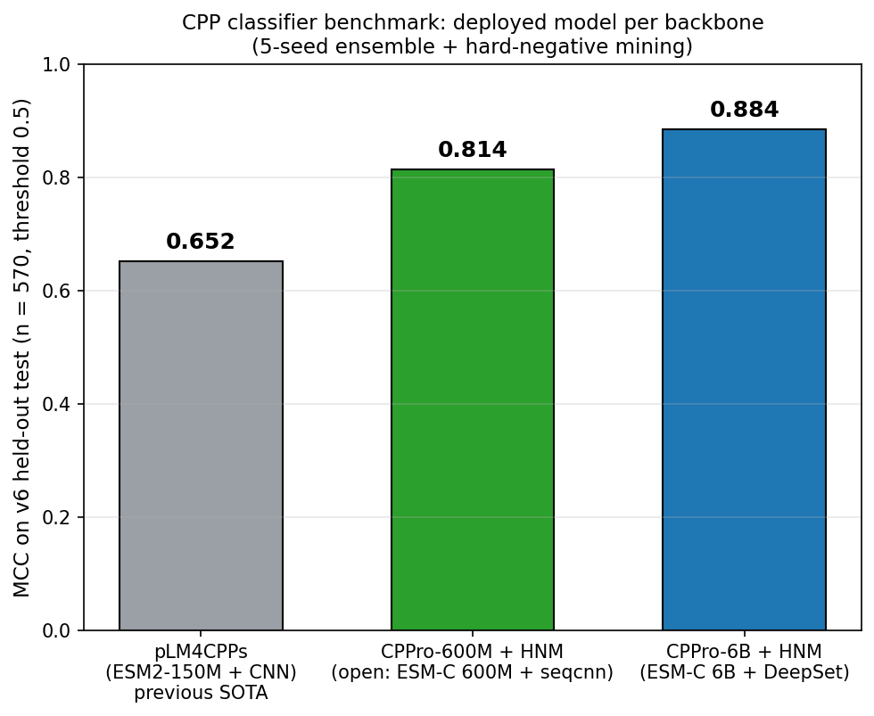
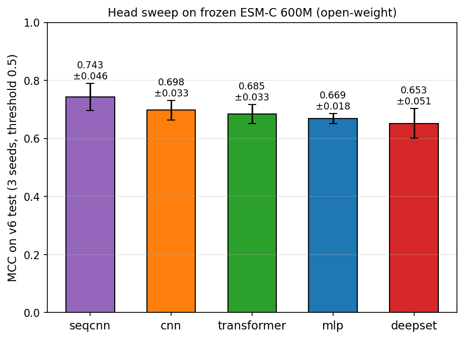
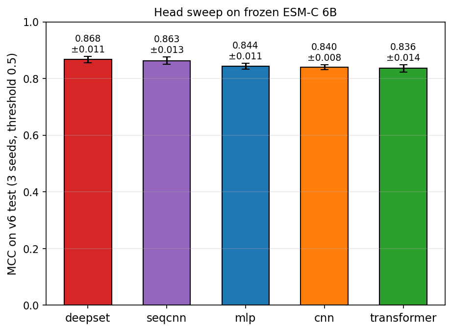
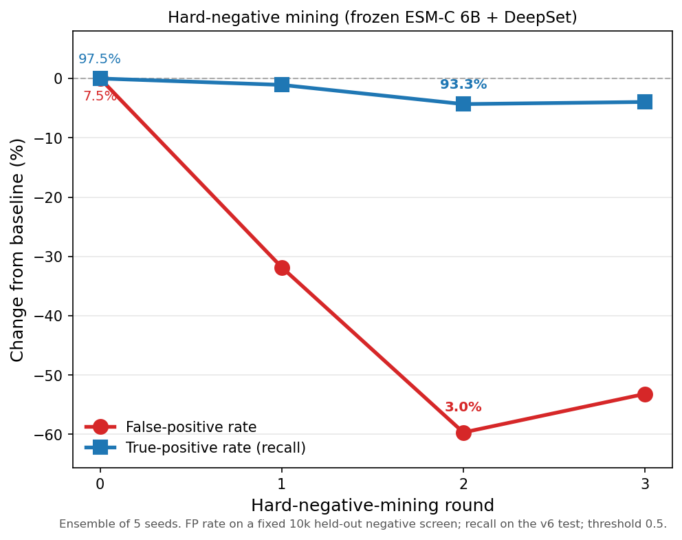
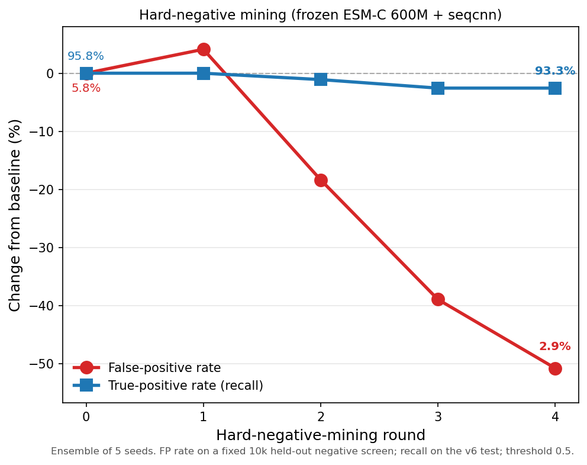

# CPPro: cell-penetrating-peptide classifier

CPPro scores a peptide for cell-penetration (CPP vs non-CPP). Given a sequence it returns
`P(CPP)` plus a per-seed disagreement flag, for screening AI-generated peptide candidates.

> **Note on hard-negative mining (read first).** Hard-negative mining (HNM) treats a large
> pool of UniProt sequences as non-CPP and folds the most CPP-like ones into training as
> negatives. On inspecting that mined set, some sequences are very likely real cell-penetrating
> peptides (for example arginine-rich peptides), even after keyword-filtering the pool, simply
> because they are absent from current CPP databases. So the HNM negative set is partly
> contaminated with probable positives, and the reported false-positive-rate reduction is
> somewhat optimistic.
>
> We still deploy the HNM models because our priority is a low false-positive rate: a false
> positive carried into the wet lab is expensive. HNM also improves held-out test MCC (600M
> 0.75 to 0.81, 6B 0.85 to 0.88) while keeping recall around 91 to 93 percent, so the cost
> appears small in practice. If you instead want maximum recall, especially on very cationic or
> arginine-rich candidates, use the **base (non-HNM)** models: 600M via
> `score_designs_600m.py --head seqcnn` (`checkpoints/frozen_600m_seqcnn/`), or 6B via
> `score_designs_with_6b_hnm.py --round 0` (`checkpoints/hnm_round0/`).

It comes in two flavours, both = a **frozen ESM-C protein language model** + a small
trained **classifier head** (no backbone fine-tuning):

| Model | Backbone | Open weights? | How to run | v6 test MCC |
|---|---|---|---|---:|
| **CPPro-6B** (best) | ESM-C 6B + DeepSet + HNM | **No** (hosted API, needs a key) | `score_designs_with_6b_hnm.py` | **0.88** |
| **CPPro-600M** (portable) | ESM-C 600M + seqcnn + HNM | **Yes** (runs locally) | `score_designs_600m.py` | **0.81** |

ESM-C 6B is the most accurate but is **not open-weight**, so it is served through a hosted
inference API and needs an API key. ESM-C 600M **is** open-weight, so CPPro-600M runs fully
locally with no key, at lower accuracy. Both beat the previous SOTA (pLM4CPPs, 0.65 on this test).

---

## Quick start (pip, zero setup)

The portable **CPPro-600M** is on the Hugging Face Hub, so you can score peptides with no
clone and no API key — it pulls the head weights + the ESM-C 600M backbone automatically:

```bash
pip install "git+https://github.com/VicCar/CPP-Pro"
cppro-score --seq RRRRRRRRR                      # -> P(CPP) + a per-seed stability flag
cppro-score --csv designs.csv --out scored.csv   # adds a cppro_prob_600m column
```

Model card + weights: **https://huggingface.co/mischievers/CPPro-600M** — the **HNM-hardened
SeqCNN ensemble** (v6 test MCC 0.81, false-positive rate ~9%, recall ~91%). The hosted 6B model
(0.88) is run from the `scripts/` below.

---

## Key results

On the v6 held-out test (n=570, threshold 0.5, exact-disjoint from pLM4CPPs + GraphCPP).
Regenerate with `python scripts/make_key_figures.py`.


 
 

- **The best classifier head depends on the backbone.** On 6B, DeepSet wins (all heads are
  statistically close); on 600M, a masked sequence-CNN wins (significantly beats DeepSet/MLP,
  ties the pooled CNN but 10x smaller). Verified with a hierarchical paired bootstrap
  (`scripts/head_bootstrap.py`).
- **Hard-negative mining** (both models) iteratively folds confident false positives from a
  large UniProt-negative pool back into training: 6B FP 7.5%→3.0% (MCC 0.85→0.88), 600M
  FP 5.8%→2.3% (MCC 0.74→0.81), recall staying ~91-93%.

---

## Use it

```bash
pip install -r requirements.txt        # one-time setup (GPU recommended)

# CPPro-600M: fully open, no API key (downloads ESM-C 600M from HuggingFace on first run)
python scripts/score_designs_600m.py --seq RRRRRRRRR
python scripts/score_designs_600m.py --csv designs.csv --out scored.csv     # adds cppro_prob_600m

# CPPro-6B: needs a hosted-API key in Biohub_key.txt (endpoint via $CPPRO_FORGE_URL)
python scripts/score_designs_with_6b_hnm.py --csv designs.csv --out scored.csv \
    --cache cache.npz --round 2                                              # adds cppro_prob (+ std)
```

Both add a per-seed `*_std` column: a high std flags an unstable / out-of-distribution call.

---

## How it works

1. **Backbone (frozen).** ESM-C embeds each residue; the backbone is never fine-tuned.
2. **Head (trained).** A small classifier on top of the cached embeddings. We swept four heads
   (MLP, pLM4CPPs-CNN, transformer, DeepSet) plus a masked sequence-CNN, picking the best per
   backbone: **DeepSet for 6B, seqcnn for 600M**.
3. **Ensemble.** 5 seeds, averaged; per-seed std is the uncertainty flag.
4. **Hard-negative mining (both models).** Iteratively fold the most confident false positives
   from a large UniProt-negative pool back into training to drive down the false-positive rate
   (6B reuses the same screening/pool split as 600M for a clean comparison).

Deployed models live in `checkpoints/`: `hnm_round2/` (6B DeepSet+HNM) and
`frozen_600m_seqcnn_hnm/` (600M seqcnn+HNM). Both ship in this repo (~17 MB each).

---

## Dataset (v6)

| Split | n | pos | neg |
|---|---:|---:|---:|
| train | 4896 | 2440 | 2456 |
| val | 554 | 285 | 269 |
| test | 570 | 285 | 285 |

57,176 unique sequences, length 5–50, canonical amino acids. Test is exact-disjoint from both
pLM4CPPs and GraphCPP training data. Full methods: `dataset/splits_v6/V6_METHODS.md`.

---

## Scripts

| Stage | Script | Does |
|---|---|---|
| **Extract** | `extract_embeddings_6b_forge.py` / `extract_v6_esmc600m.py` | cache ESM-C 6B (API) / 600M (local) embeddings |
| **Train** | `train_save_hnm_ensemble.py` / `train_save_600m.py` | train + save the deployed 6B / 600M ensembles |
| | `hnm_round_6b.py` | one round of hard-negative mining (6B) |
| **Score** | `score_designs_with_6b_hnm.py` / `score_designs_600m.py` | score new peptides (6B / 600M) |
| **Analyse** | `head_sweep_6b.py` / `head_bootstrap.py` | classifier-head comparison + significance test |
| | `make_key_figures.py` | regenerate the 4 headline figures |

`scripts/` = code, `results/` = its CSV/JSON output, `figures/` = the committed headline plots.
Embedding caches (`embeddings/*.h5`) are re-extractable and not shipped.
